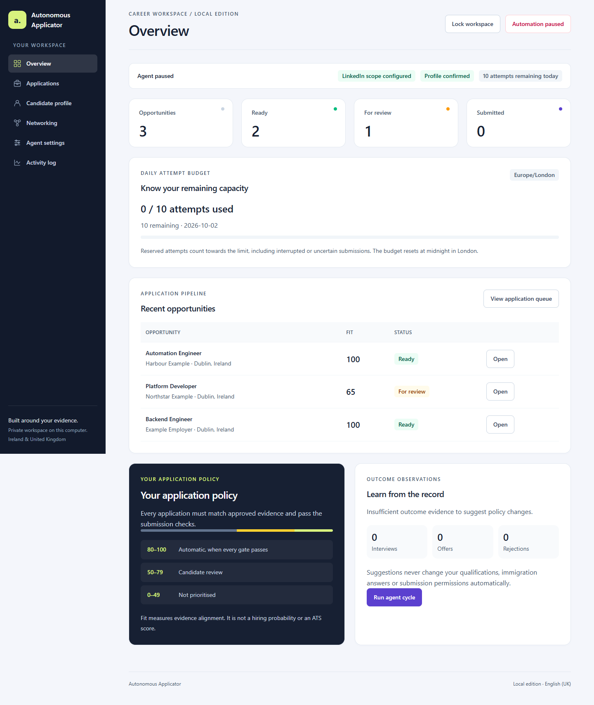
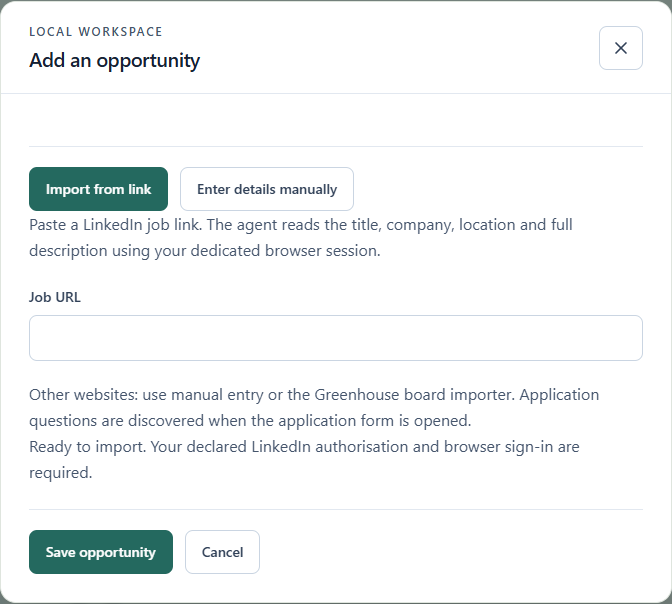
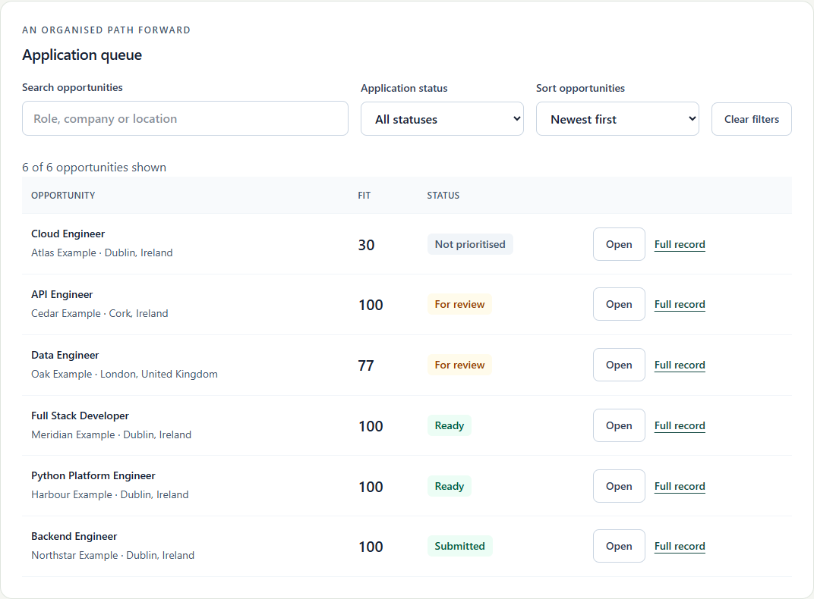
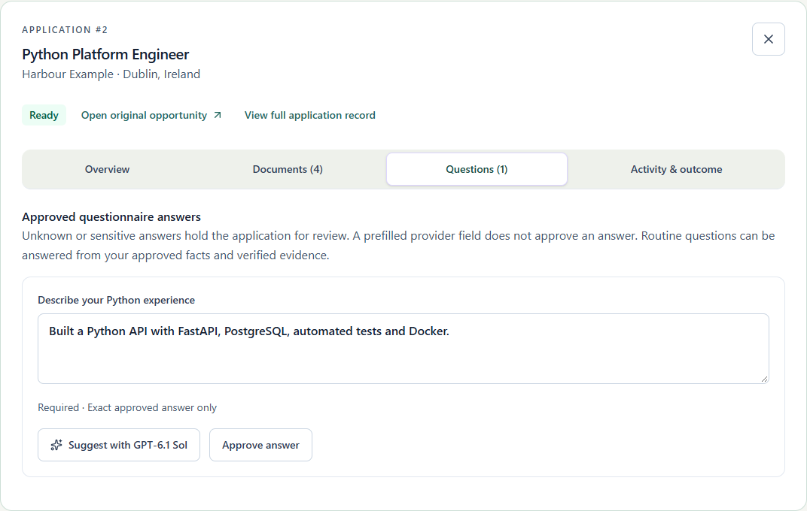
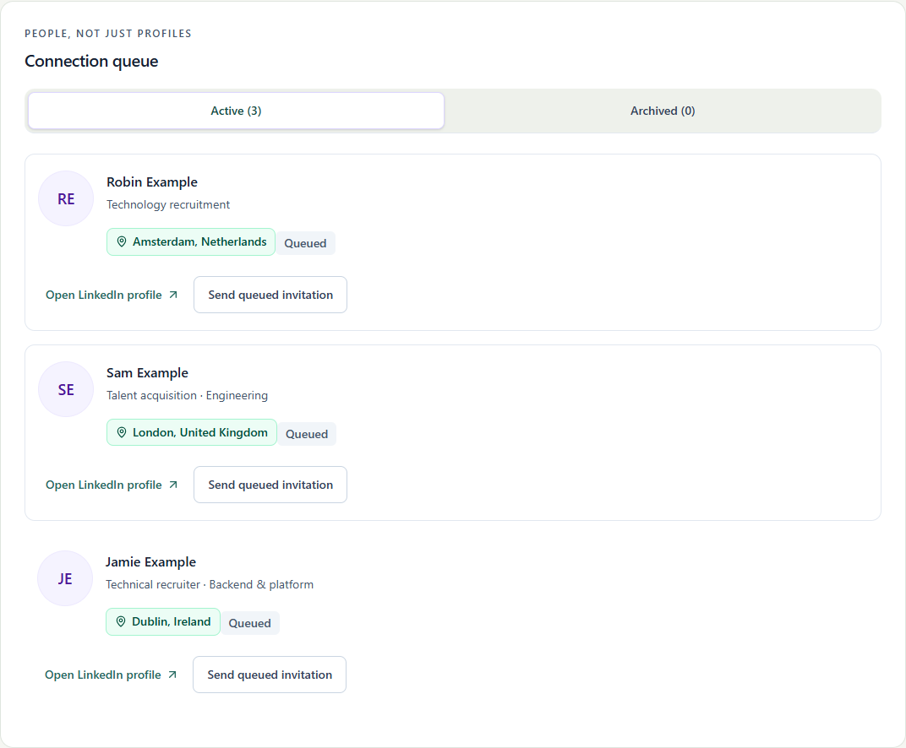
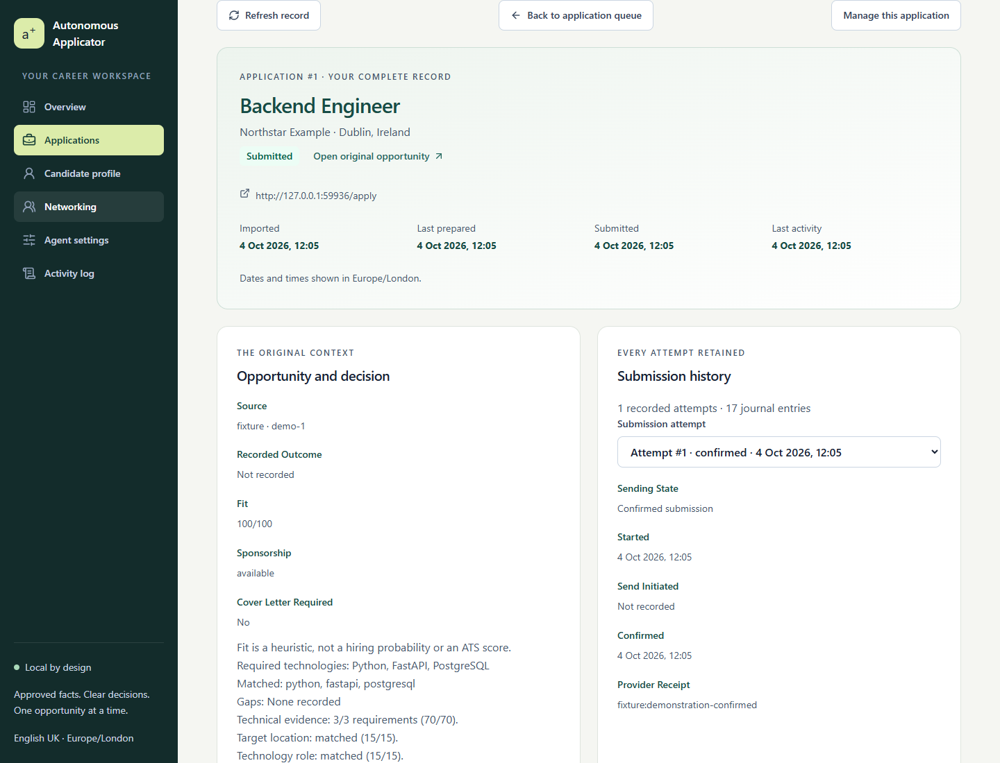
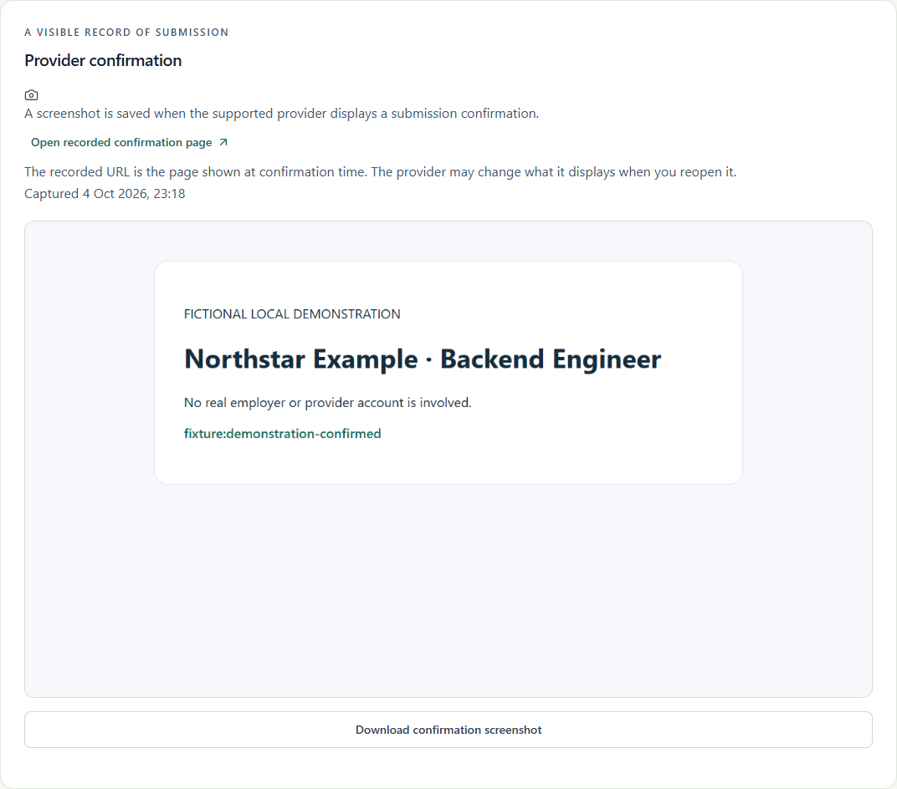
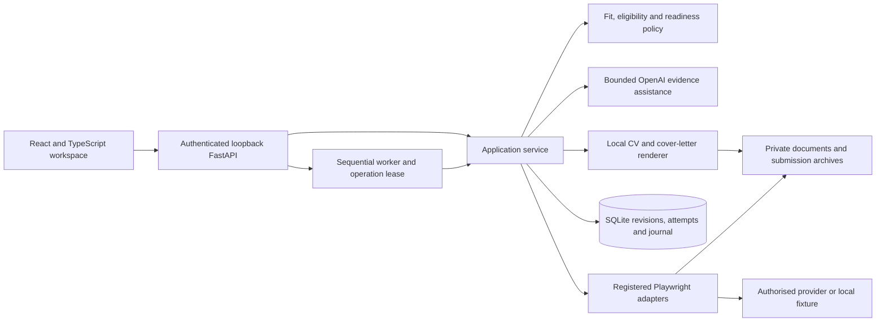

# Autonomous Applicator


**An evidence-led career workspace: tailored applications, controlled automation and a record of every decision.**

[](https://github.com/ricardoportoIE/autonomous-applicator/actions/workflows/ci.yml)
[](docs/FRONTEND.md#development-and-checks)
[](docs/TESTING.md#backend-acceptance-gate)

A personal engineering portfolio project by [Ricardo Porto](https://github.com/ricardoportoIE), built around a practical problem: preparing relevant job applications without losing control of candidate facts, external actions or submission history.

The system combines a React and TypeScript dashboard, a Python API, grounded AI assistance and permitted browser integrations. It evaluates opportunities, prepares vacancy-specific CVs and cover letters, processes one application at a time, and preserves what was actually sent. Candidate knowledge and automation policy remain under the user's control.

**Python · FastAPI · SQLite · React · TypeScript · Tailwind CSS · Playwright · OpenAI Responses API · GitHub Actions**



*Screenshots updated on 4 October 2026. All candidate, vacancy, recruiter and outcome data shown are fictional. The confirmation comes from a disposable local provider fixture, not a real employer application. These are captures of the packaged interface, not design mock-ups.*

## The product problem

A successful browser click is not enough to establish a trustworthy application. The system must know which candidate facts were approved, whether the vacancy still matches the reviewed details, which documents were uploaded, and whether the provider actually confirmed receipt.

The product prioritises factual integrity and recoverability over throughput. Preparation and submission are separate decisions: the queue can keep preparing interesting opportunities after the daily sending limit is reached, while exceptional answers, incompatible requirements and unfamiliar provider behaviour remain visible for review.

Discovery diagnostics identify each read stage, the current vacancy's position and its canonical URL. Bounded waits accommodate slower provider pages, and controlled failure advice keeps private browser diagnostics out of the journal. See [application queue operations](docs/APPLICATION_QUEUE.md) for ordering, time budgets and recovery.

Question approval is scoped to one application. It rechecks readiness, preserves current verified CVs and leaves other applications intact. The worker resumes eligible saved opportunities before searching again, completes each vacancy in FIFO order and continues preparation when daily sending capacity is exhausted. Unknown provider questions retain their exact choices for deliberate review.

Legacy answers must still match the observed question. A narrative stored against a years-of-experience question cannot bypass numeric validation or mask a grounded numeric resolution. Exact compatible approvals retain priority; otherwise the browser consults the normal resolver, which requires explicitly approved work experience for a work-duration answer. Unknown numbers remain unanswered. [Question interpretation](docs/QUESTION_INTERPRETATION.md#legacy-duration-answers) explains scoped correction without changing unrelated candidate records.

**Application queue** separates **Active** work from an **Archive** of confirmed submissions. Archived rows retain their full records, documents, receipts and original links; uncertain and review records stay active. Automatic discovery assesses the full vacancy description against confirmed candidate evidence before intake. Scores below **50/100** create a private exclusion-log entry rather than an application; later LinkedIn searches skip those identifiers before opening their detail pages. LinkedIn, Greenhouse and background discovery share this rule. Explicit manual/URL imports and existing applications remain available. [Queue and discovery design](docs/APPLICATION_QUEUE.md#discovery-screening-and-exclusion-memory) records the limits and separate authenticated log.

Questionnaire collection gathers unresolved questions across every safely reachable form page or dialogue before requesting review. It also checks conditional fields revealed by approved answers and fields exposed by provider validation. The Questions tab displays the collection summary so the candidate can review the batch together. Required answers can block access to later pages: the agent records that limit, keeps unknown fields unanswered and never sends an application with pending questions.

Questions preserve up to 500 exact choices, including observed 249-option telephone-country dropdowns. Approved international telephone prefixes select the matching enabled country locally; missing contact facts retain the complete list for review. The application question count and semantic HTML limits remain bounded.

The agent saves private, sanitised dialogue HTML before leaving pages with pending questions and when a form fails before sending. Diagnostic events identify the vacancy, step, stage, capture time and file hash. Vacancy-specific CV uploads verify the current document selection and reject empty, unsupported or oversized files before upload; the conservative limit is strictly below 2,000,000 bytes. [Form diagnostics and upload checks](docs/OPERATIONS.md#private-form-diagnostics-and-resume-uploads) explain the local evidence and recovery boundaries.

The browser distinguishes text and typed inputs, native selects, radio groups, native/ARIA checkboxes, mapped ARIA dropdowns and the supported city typeahead. It reads enabled choices, uses approved facts or exact answers, validates numeric requirements and field constraints, and confirms the resulting selection. City suggestions must uniquely match the confirmed current city and country. Provider validation and closed-vacancy messages produce specific holds. Unknown consent and ambiguous controls stay in review. **Start agent / Pause agent** wakes or pauses the same background worker immediately, retaining the separate networking preference.

City suggestions can render in a portal outside their field or dialogue. The adapter follows the explicit `aria-labelledby` relationship to the current input, requires one visible linked list and validates the selected city/country. Missing or ambiguous linked lists remain in review; a suggestion timeout now retains the other questions on the current page instead of interrupting collection.

For unfamiliar ordinary questions, GPT-6.1 Sol interprets the field's wording and value-free semantic HTML, including its type, enabled choices and constraints. It selects an available approved-fact mapping or verified evidence; the application derives the answer locally and validates the actual control before advancing. Application-scoped approvals retain priority. The [questionnaire interpretation design](docs/QUESTION_INTERPRETATION.md) explains data minimisation, progress reporting and review boundaries. An eight-case fictional API comparison improved correct outcomes from 2/8 to 8/8, including two deliberate review cases; this is a bounded regression sample, rather than a general accuracy claim.

CV selection is proved against the current selected document card, rather than filename occurrence count. Within one application, verified uploads are reused by content hash and DOM identity. Numeric years answers are checked before submission readiness, whilst explicit provider range choices remain valid. [Operational diagnostics](docs/OPERATIONS.md#duplicate-cv-labels-and-numeric-experience-answers) explains the recovery and review boundaries.

## What the workspace does

| Capability | User outcome |
| --- | --- |
| Discovery and import | Paste a LinkedIn job link to read and queue the vacancy, search configured opportunities, import a public Greenhouse board or enter details manually. Search, filter and sort the queue. |
| Explainable fit | Inspect matched technologies, evidence gaps, location considerations and explicit blockers before acting. |
| Tailored documents | Generate A4 PDF/DOCX CVs and a required cover letter from approved evidence, with hashes and preparation provenance. |
| Questionnaire assistance | Resolve routine questions from approved facts; request a separate GPT-6.1 Sol draft and explicitly review, edit and approve it. |
| Sequential processing | Follow the current opportunity, stage, elapsed time, run identifier and failure point. Start or pause background application and networking work. |
| Complete records | Inspect dated attempts, candidate and opportunity snapshots, archived documents, observed form answers, receipts and private confirmation screenshots. |
| Professional networking | Review European hiring contacts, open their profiles and send an invitation to the selected person without a note. Confirmed invitations move to Archived. |
| Candidate and policy management | Maintain qualifications, source evidence, exact answers, eligibility facts, search preferences and independent daily limits. |

### Queue and review



**Add opportunity** defaults to pasting a LinkedIn job link. The agent reads verified primary job details in the dedicated browser and saves the vacancy to the preparation queue. Importing shows visible progress, preserves duplicate records and retains failed drafts for an explicit retry. The modal capture above was updated on 6 October 2026 using a disposable fictional candidate; no provider account or model call was used. See [single-link operations](docs/OPERATIONS.md#import-one-opportunity-from-its-link) for supported links and review boundaries.



**A high score does not override a factual or operational blocker.** In this fictional queue, the Cork vacancy has a 100/100 technical fit but remains in review because its location needs acceptance.

<details>
<summary>View questionnaire controls, networking and the mobile queue</summary>



AI suggestions do not save or approve themselves. The candidate keeps the final decision.



Initials appear when no private portrait is available. Each send acts on the selected person only.

[View the complete mobile queue screenshot](docs/assets/mobile-queue.png). Browser tests also check mobile, tablet, desktop, enlarged text and keyboard navigation.

</details>

### What was submitted



<details>
<summary>View captured confirmation evidence from the local demonstration provider</summary>



Supported confirmed browser submissions can retain a private screenshot, its hash, capture time and observed provider URL. Missing historical evidence and capture failures are shown explicitly. A screenshot failure does not erase an otherwise confirmed receipt.

</details>

## Engineering decisions

Business rules are invariants enforced by the API and persistence layer. The interface explains those rules; it is not their only gate.

| Problem | Decision and trade-off | Implementation evidence |
| --- | --- | --- |
| AI can select irrelevant material or invent facts | Constrain structured output to approved evidence references and render factual wording locally. Trade creative flexibility for traceability. | [Evidence adviser](src/applicator/adviser.py), [CV audit](docs/CV_PREPARATION.md) |
| A send can succeed even when its response is lost | Reserve capacity transactionally and hold uncertain outcomes for reconciliation. External mutations are never retried automatically. | [Submission service](src/applicator/service.py), [transactional store](src/applicator/store.py) |
| Concurrent work can mix vacancies or reuse a browser | Use an operation lease and process applications sequentially, attributing progress to one opportunity. | [Queue design](docs/APPLICATION_QUEUE.md), [operation ownership](src/applicator/operations.py) |
| Candidate facts can change while a CV or form is open | Version profiles, bind drafts to their opening revision, compare job/profile fingerprints and recheck document hashes before sending. | [Workspace controller](frontend/src/workspace.ts), [document validation](src/applicator/documents.py) |
| Late reads can replace a newer page or reveal locked data | Use session generations and request ownership; invalidate obsolete responses and revoke private blob URLs. | [API client](frontend/src/api.ts), [race regressions](tests/frontend/session-races.test.ts) |
| Today's profile does not prove yesterday's submission | Archive per-attempt snapshots and documents; keep observed provider fields separate from supplied candidate facts. | [Submission records](src/applicator/submission_records.py), [record browser tests](tests/test_submission_record_browser.py) |
| Unbounded automation complicates recovery | Require configured scope, bounded adapters, confirmed-send limits and manual handling of unsupported portals. Prefer an explained stop to a guessed action. | [Operating guide](docs/OPERATIONS.md), [browser adapters](src/applicator/browser.py) |
| A private tool still needs accessible, maintainable UX | Use strict TypeScript, native dialogues, labelled controls and keyboard tabs; serve local compiled assets under CSP. | [Feature map](docs/FRONTEND.md), [production UI tests](tests/test_react_frontend.py) |

### Decision policy

- **80–100:** eligible for automatic submission only when all required checks pass.
- **50–79:** candidate review.
- **0–49:** not prioritised.

Fit is a transparent heuristic, not an ATS score or hiring probability. Missing eligibility answers, stale documents, unconfirmed facts, disabled automation, an unsupported provider or an uncertain previous send can prevent submission regardless of score. Unmentioned sponsorship is unknown, not a refusal.

The application limit counts **confirmed sends** in the Europe/London day. Pending and uncertain sends hold capacity separately. Planning, routine answers and document preparation continue when sending capacity is full. Interesting distant or overseas vacancies can receive documents before location review. Networking has its own daily attempt limit and enable switch.

## Architecture



**React owns presentation and explicit commands.** The workspace controller manages immutable snapshots, session boundaries, routes, polling and invitation observation. Forms capture inputs before asynchronous work disables controls; failed saves retain editable drafts.

**Python owns application decisions.** Pydantic validates contracts, SQLite transactions enforce revisions and capacity, and the service verifies materials before handing them to a registered provider. Durable journals and stage records support failure diagnosis and interrupted-work review.

**SQLite and local files suit the current single-user deployment.** They keep setup small and records inspectable. Distributed workers, multi-tenant authentication and remote storage would require different consistency and privacy boundaries; this implementation does not claim them. See [architecture and submission invariants](docs/ARCHITECTURE.md).

## AI with explicit boundaries

The configured model is **`gpt-6.1-sol`**, called through the OpenAI Responses API with structured output, `store=False`, a bounded timeout and no automatic provider retries.

For documents, AI ranks existing evidence identifiers for the vacancy. Validation rejects unknown or unapproved references, mismatched model identity and stale profile/job fingerprints. The local renderer preserves factual wording and records the model, evidence references and generation metadata. With AI preparation enabled, API or validation failures leave the opportunity in review without silently falling back to another preparation method.

For questionnaires, **Suggest with GPT-6.1 Sol** returns a separate draft with supporting facts and review notes. Contact fields and sensitive answers are excluded from that request. Unknown legal, immigration or exceptional facts require candidate input; a provider's prefilled answer is not approval.

Browser recovery remembers verified native, label or ARIA interactions in local SQLite, keyed by control shape rather than a person's answer. Every reuse checks the current question, choices and resulting state. Reversible controls and unchanged Next/Review steps have three recovery passes; a proven pre-submission technical hold can resume at most twice when readiness still passes. Documents are reused, and a sending or uncertain attempt is never replayed. This is bounded operational learning; the system does not retrain itself, change qualifications or alter submission permissions automatically. [Live AI comparisons](docs/AI_BENCHMARK.md) and the [vacancy-specific CV audit](docs/CV_PREPARATION.md) document separately authorised experiments; ordinary tests use fixtures and incur no model charges.

Resume recovery recognises contained filenames and exact accessible radio names, verifies fresh selection and preserves document hash checks. Navigation observes the actual form step after a click timeout before another reversible action. Verified resume strategies and navigation outcomes survive restart as allowlisted local hints. Unknown experience figures and work preferences remain deliberate review decisions.

## Quality and verification

The frontend review expanded measurement from three helpers to **all ten authored runtime TypeScript/TSX files**, including the bootstrap. The latest complete baseline passed **162 Vitest tests with 100% lines, statements, functions and branches**, enforced **per file** in CI. Subsequent archive/discovery changes received focused acceptance checks recorded in [delivery status](docs/STATUS.md); full coverage was not remeasured for those changes. Only type-only contracts and declaration files are excluded. Libraries, generated bundles and test code are outside this measurement.

| Verification layer | What it checks |
| --- | --- |
| Vitest and React Testing Library | Saved form payloads, failure feedback, application states, accessible interactions, routing, session races and private image/download cleanup. |
| Production Playwright and axe | Packaged React against FastAPI with CSP enabled, downloads, keyboard focus, responsive layouts and accessibility rules. V8 coverage is reported separately from jsdom coverage. |
| Python unit, integration and property tests | Policy boundaries, transactional attempts, concurrent edits, stale materials, provider contracts, grounded AI references, document integrity and recovery. |
| Security regressions | Ambiguous Host/Origin rejection, authenticated private resources, bounded and timed request intake, exclusive token creation, streamed board limits, compression refusal and browser redirect/cookie isolation. |
| Offline performance measurements | Median/p95 dashboard reads at 1, 100 and 1,000 fictional opportunities, response sizes and a separate Python allocation probe; timings are recorded rather than gated against inconsistent runner hardware. |
| Static and dependency checks | Strict TypeScript and mypy, ESLint, Ruff, Prettier, npm audit, pip-audit and tracked-file privacy checks. |
| Packaging and CI | Reproducible committed assets and a Windows/Linux matrix on Python 3.12 and 3.14 with Node.js 24. |

The backend requires **100% statement and branch coverage in every one of its 19 Python modules**. CI checks the complete source inventory and rejects missing paths or runtime exclusions on every Windows/Linux and Python 3.12/3.14 job; each run records its exact interpreter-specific statement and branch counts. React unit tests retain their separate 100% per-file runtime coverage gate. [Testing and coverage](docs/TESTING.md) defines the scope, fixtures and reproduction commands.

Verification results, measured coverage and any outstanding checks are recorded in [delivery status](docs/STATUS.md). [Review findings](docs/CODE_REVIEW.md) explain corrected faults and their regressions. Coverage establishes execution, not compatibility with every live provider layout; behaviour assertions and isolated provider fixtures provide additional evidence.

The latest complete Python baseline passed **1,151 cases**, including security, bounded form recovery, questionnaire interpretation, CV selection, application-scoped approval and single-link imports. That Windows/Python 3.14.2 run covered **3,083/3,083 statements and 1,088/1,088 branch outcomes**, with 100% in all 19 runtime modules. Subsequent changes passed **12 large-choice regressions** and **30 focused diagnostic/upload checks**, including 29 new cases and one existing successful provider flow. The complete coverage suite was not rerun for these changes. [Delivery records](docs/STATUS.md) identify the revision and scope of each measurement. Production Chromium coverage is reported separately: **98.69% statements/lines, 92.37% branches and 97.54% functions**. The [threat model](docs/SECURITY.md) defines protection against hostile pages, malformed requests and untrusted provider content. Tests isolate credentials and prevent CLI fixtures from loading the operator's `.env`. The [offline benchmark](docs/PERFORMANCE.md) records bounded in-process read measurements, excluding browser rendering, document generation and model/provider latency.

## Run locally

Prerequisites: Python 3.12 or later, `uv`, and a supported Playwright browser. Node.js 24 is needed for frontend development and full verification. The Python application serves committed production assets without a Node server or CDN.

```powershell
git clone https://github.com/ricardoportoIE/autonomous-applicator.git
cd autonomous-applicator
uv sync --extra dev --python 3.14
uv run python -m playwright install chromium
New-Item -ItemType Directory -Path data -Force | Out-Null
powershell -NoProfile -ExecutionPolicy Bypass -File scripts/protect_private_workspace.ps1
uv run python -m applicator.cli serve
```

On Windows, browser integrations use installed Edge when available. Open **http://127.0.0.1:8765** and enter the local token printed by the server. Keep the token private and the server bound to loopback. Add and confirm candidate facts in the dashboard before enabling automation.

The private-permissions command above is for Windows. It restricts existing `data`, `tmp`, `output` and private `.env` files to the current account, SYSTEM and Administrators, saves prior DACLs locally and refuses reparse points. Source files and `.env.example` retain their permissions. On another operating system, secure these paths with account permissions before storing credentials. Custom data directories outside the repository require their own permissions. See [security](docs/SECURITY.md#credential-and-file-handling).

For AI, copy `.env.example` to the ignored local `.env`, rerun the Windows private-permissions helper before adding credentials, set a fresh `OPENAI_API_KEY`, retain `OPENAI_MODEL=gpt-6.1-sol`, and restart the server. Enable **Use GPT-6.1 Sol for document preparation by default** in Agent settings. The Python server loads the key; the frontend does not receive it.

For permitted LinkedIn access, complete manual sign-in and verification in the dedicated browser:

```powershell
uv run python -m applicator.cli browser-login
```

Configure the declared scope separately in Agent settings. The public profile is not edited. Supported invitations use **Send without a note**; unsupported portals retain manual hand-off. See [setup, permissions and recovery](docs/OPERATIONS.md).

### Development checks

```powershell
npm ci
npm run typecheck
npm run lint
npm run format:check
npm test
npm run build
uv run python -m ruff check .
uv run python -m mypy src
uv run python -m pytest
uv run python scripts/check_backend_coverage.py
npm run coverage:browser
npm audit --audit-level=low
uv run python -m pip_audit
uv run python scripts/check_repository_hygiene.py
```

Run browser coverage after the Python suite, which captures production V8 coverage. Reports go to ignored `test-results/unit-coverage` and `test-results/frontend-report`. Commit frontend sources with rebuilt `src/applicator/static` output; CI rejects asset drift.

Reproduce the main screenshot gallery with `uv run python scripts/capture_screenshots.py` after building. The script uses a disposable database, a fictional candidate and a loopback provider fixture. It blocks external browser requests and makes no OpenAI calls. Public assets never come from the live workspace.

## Delivery and ownership

Requirements, business rules, architectural boundaries, failure recovery and validation are documented alongside the code. Changes are delivered through Git commits and a repeatable cross-platform pipeline. Feature mapping makes UI migrations reviewable; provenance and journals make application decisions inspectable.

| Document | Purpose |
| --- | --- |
| [Requirements](docs/REQUIREMENTS.md) | Product scope and acceptance criteria. |
| [Architecture](docs/ARCHITECTURE.md) | Service boundaries and submission invariants. |
| [Queue operation](docs/APPLICATION_QUEUE.md) | Ordering, stage visibility, leases and recovery. |
| [Frontend](docs/FRONTEND.md) | Preserved capabilities, async ownership and coverage scope. |
| [Testing and coverage](docs/TESTING.md) | Backend and frontend coverage gates, failure assertions, isolated fixtures and reproduction. |
| [Security and privacy](docs/SECURITY.md) | Loopback access, secrets and private artefacts. |
| [Performance](docs/PERFORMANCE.md) | Reproducible offline read workloads, measured resource use and interpretation. |
| [Operating guide](docs/OPERATIONS.md) | Configuration, sign-in, review and reconciliation. |
| [CV preparation](docs/CV_PREPARATION.md) | Vacancy targeting, factual preservation and provenance. |
| [AI benchmark](docs/AI_BENCHMARK.md) | Measured, separately authorised model experiments. |
| [Delivery status](docs/STATUS.md) | Capabilities, validation results and limitations. |
| [Code review](docs/CODE_REVIEW.md) | Findings, corrections and regression evidence. |
| [Improvements](docs/IMPROVEMENTS.md) | Prioritised follow-up work and rationale. |

## Scope and limitations

This is a tested single-user local prototype. Real provider access depends on valid authorisation, manual sign-in, current page contracts and a registered adapter. Unknown controls, changed vacancy details, ambiguous uploads and unconfirmed sends stop for review. Fixture results do not certify the current LinkedIn interface or every employer questionnaire.

The project does not claim hiring outcomes, ATS acceptance, distributed scale or autonomous self-training. Candidate records, credentials, generated documents, browser sessions and real confirmation screenshots remain local and outside Git. Public screenshots and test records are fictional; paid AI experiments are documented separately.
