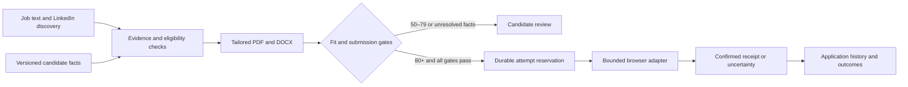

# Architecture

## Components

FastAPI serves a same-origin dashboard and a token-protected API. SQLite persists versioned profiles, jobs, applications, document manifests, provider attempts and an append-only event log. Documents and dedicated browser profiles live in the ignored data directory.

The dashboard is a React/TypeScript application built with Vite and locally compiled Tailwind CSS. Components render immutable workspace snapshots; a separate typed API client and workspace controller own session generations, mutation ownership, polling and private portrait caches. Creation/editing forms use native dialogues and application details use keyboard-accessible tabs. The packaged production bundle is served directly by FastAPI under the existing CSP. See [frontend architecture and feature parity](FRONTEND.md).

The deterministic policy engine owns score thresholds and submission gates. An optional OpenAI adviser selects evidence for a job. Model output never grants browser or submission permissions. Web pages and attached documents are untrusted content rather than executable instructions.

The renderer copies approved evidence into tailored PDF/DOCX documents. Questions first use explicit candidate-approved answer keys. Routine factual questions can also use exact candidate fields or verified evidence, scoped to the application, profile revision and opportunity fingerprint. GPT-6.1 Sol selects evidence identifiers for supported professional prose; the system copies the approved source text rather than accepting generated factual claims. The LinkedIn adapter uses a dedicated local browser session and the candidate's declared authorisation scope. It verifies job identity and description, bounds the number of steps, rejects unsupported fields and requires a visible confirmation. Its selectors are tested on intercepted fixtures and still require live account validation. No adapter modifies the public profile.

## Submission invariants

`submission_records` stores one private snapshot per reserved attempt, linked to the existing application/attempt journal. Before provider activity, the service verifies and copies prepared materials into `data/submissions/{application}/{attempt}/documents/`. The adapter receives this archive rather than the replaceable preparation directory. LinkedIn repeats manifest integrity checks in its final pre-click gate. Contact facts, selected evidence wording, job details, known approved answers and generation metadata are preserved independently of later profile or opportunity edits.

Supported adapters record actual observed form values and uploads, including step numbers when available. Checked radio choices are stored under their question group; observations for different steps remain distinct. Sending/confirmation timestamps are recorded in the same SQLite transactions as the corresponding attempt transitions. Visible provider confirmation precedes PNG capture. Capture errors are metadata, not uncertainty or a reason to repeat the send. Authenticated artifact reads require matching application ownership, safe local paths, bounded size and the archived hash. Existing attempts without snapshots remain explicitly incomplete.

The service checks current policy, provider capability, scope, target identity, document hashes, a required cover PDF and known questionnaire answers before requesting a reservation. An immediate SQLite transaction then rechecks automation, scope, profile revision, current policy, manifest presence and the daily limit. The attempt is committed before external activity. Success needs a provider receipt. A known pre-submission stop becomes review and records unknown question labels; failure after attempting the irreversible action becomes uncertain. A separate confirmed manual outcome can reconcile the attempt.

The worker checks the kill switch before each attempt. It cannot undo a submission already in flight. One application per canonical source identifier prevents duplicates. Editing evidence changes the revision and requires regenerating materials. Settings changes do not manufacture eligibility.

## Inspection and queue navigation

| Authenticated read endpoint | Result |
| --- | --- |
| `GET /api/usage` | Confirmed London-day sends, separate pending/uncertain holds, diagnostic attempts, configured limit and remaining capacity |
| `GET /api/applications/{id}/preflight` | Current fit evaluation and named local submission checks with passed/blocked explanations |
| `GET /api/applications/{id}/events` | Latest 200 events belonging to this application, newest first |
| `GET /api/applications/{id}/record?before={event_id}` | Per-attempt submission snapshots, timestamps, observations, confirmation metadata and cursor-paginated journal |
| `GET /api/applications/{id}/submissions/{attempt}/artifacts/{key}` | Authenticated, hash-verified archived document or confirmation PNG belonging to this application and attempt |

Preflight calls read local records and verify document files. They do not reserve an attempt, generate materials, start a browser, call the adviser or append events. Each report has a UTC timestamp. It is an advisory snapshot rather than a transaction locking the candidate record; actual submission repeats the gates. Provider sign-in, changed descriptions, newly discovered questions and uploads remain live adapter responsibilities.

Daily usage reads the saved limit, confirmed sends and held capacity in one SQLite statement. Only confirmed sends increment `used`; pending or uncertain sends increment `held` and reduce available sending capacity until reconciliation. Proven pre-submission stops release their hold in the same transaction as the review record. Manual confirmed receipts count as sent applications. The journal retains every attempt for diagnostics. The worker continues preparation when sending capacity is exhausted. Europe/London calendar boundaries use timezone rules, including summer time. Remaining capacity cannot become negative if the candidate lowers a limit.

Queue listings fetch and decode records in one connection. Journal and attempt-day indexes support scoped histories and budget counts. Dashboard search/status/sort operations work on the loaded records without mutating them. A pure helper supplies consistent, tested ordering, with record identifiers breaking ties. Filtering does not change routing or eligibility.

## Sequential processing and ownership

Application processing uses a FIFO snapshot ordered by the immutable import identifier, independently of dashboard sorting. The service completes preparation and submission for one eligible record before taking the next. It reloads the record, profile revision, pause state and quota rather than treating the snapshot as approval. Current-revision reviews, submitted records, reconciliation holds and skipped opportunities are excluded. New imports wait for the next snapshot. Safe failures become review holds; an unknown provider outcome remains uncertain.

Manual preparation, manual submission and automatic cycles share a SQLite single-owner lease. A partial unique index permits only one running application operation. The API claims ownership before waiting for the dedicated browser lock, so competing application requests return a busy conflict instead of silently queueing another cycle. A workspace-level operating-system lock prevents a second server from recovering another live server's records. Graceful shutdown retains that lock until the background worker finishes its current operation and stops taking new vacancies.

Stage updates and results are committed separately from slow model/browser calls. The authenticated GET /api/worker/status route returns the current or latest run and the latest 50 per-application results across runs, without acquiring the browser lock. The browser reports identity checks, form steps, document uploads, approved questions, the irreversible click and receipt confirmation. Run IDs connect timestamps and stage labels to the application's journal. Progress reports carry fixed descriptions and exception classes, excluding answer values, credentials and raw provider diagnostics.

Restart recovery retains the interrupted stage. Pending preparation records lose their submission manifest and become current-revision review holds; reserved submissions become uncertain. Neither state is automatically retried. The latest results remain readable across subsequent empty cycles. Dashboard polling observes these records without starting work, survives reloads, discards locked-session responses and keeps elapsed-time updates outside the live announcement region.

## Learning

Outcome feedback supports aggregate observations and candidate-reviewed suggestions. It does not self-train model weights, add skills, alter immigration facts, lower thresholds or fabricate experience. Small samples are reported as insufficient evidence, not causal proof.

## Official integration references

- [GPT-6.1 Sol](https://developers.openai.com/api/docs/models/gpt-6.1-sol)
- [Structured outputs](https://developers.openai.com/api/docs/guides/structured-outputs)
- [Greenhouse Job Board API](https://docs.greenhouse.io/job-board.html): public discovery is distinct from authenticated employer-owned application submission.
- [LinkedIn User Agreement](https://www.linkedin.com/legal/user-agreement)
