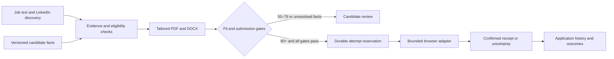

# Architecture

## Components

FastAPI serves a same-origin dashboard and a token-protected API. SQLite persists versioned profiles, jobs, applications, document manifests, provider attempts and an append-only event log. Documents and dedicated browser profiles live in the ignored data directory.

The deterministic policy engine owns score thresholds and submission gates. An optional OpenAI adviser selects evidence for a job. Model output never grants browser or submission permissions. Web pages and attached documents are untrusted content rather than executable instructions.

The renderer copies approved evidence into tailored PDF/DOCX documents. Questions are matched to explicit candidate-approved answer keys. The LinkedIn adapter uses a dedicated local browser session and the candidate's declared authorisation scope. It verifies job identity and description, bounds the number of steps, rejects unsupported fields and requires a visible confirmation. Its selectors are tested on intercepted fixtures and still require live account validation. No adapter modifies the public profile.

## Submission invariants

The service checks current policy, provider capability, scope, target identity, document hashes, a required cover PDF and known questionnaire answers before requesting a reservation. An immediate SQLite transaction then rechecks automation, scope, profile revision, current policy, manifest presence and the daily limit. The attempt is committed before external activity. Success needs a provider receipt. A known pre-submission stop becomes review and records unknown question labels; failure after attempting the irreversible action becomes uncertain. A separate confirmed manual outcome can reconcile the attempt.

The worker checks the kill switch before each attempt. It cannot undo a submission already in flight. One application per canonical source identifier prevents duplicates. Editing evidence changes the revision and requires regenerating materials. Settings changes do not manufacture eligibility.

## Inspection and queue navigation

| Authenticated read endpoint | Result |
| --- | --- |
| `GET /api/usage` | Current London-day application reservations, configured limit and remaining capacity |
| `GET /api/applications/{id}/preflight` | Current fit evaluation and named local submission checks with passed/blocked explanations |
| `GET /api/applications/{id}/events` | Latest 200 events belonging to this application, newest first |

Preflight calls read local records and verify document files. They do not reserve an attempt, generate materials, start a browser, call the adviser or append events. Each report has a UTC timestamp. It is an advisory snapshot rather than a transaction locking the candidate record; actual submission repeats the gates. Provider sign-in, changed descriptions, newly discovered questions and uploads remain live adapter responsibilities.

Daily usage reads the saved limit and counted reservations in one SQLite statement. Every reserved attempt counts, regardless of receipt or uncertainty; manual receipts do not create reservations. Europe/London calendar boundaries use timezone rules, including summer time. Remaining capacity cannot become negative if the candidate lowers a limit.

Queue listings fetch and decode records in one connection. Journal and attempt-day indexes support scoped histories and budget counts. Dashboard search/status/sort operations work on the loaded records without mutating them. A pure helper supplies consistent, tested ordering, with record identifiers breaking ties. Filtering does not change routing or eligibility.

## Learning

Outcome feedback supports aggregate observations and candidate-reviewed suggestions. It does not self-train model weights, add skills, alter immigration facts, lower thresholds or fabricate experience. Small samples are reported as insufficient evidence, not causal proof.

## Official integration references

- [GPT-6.1 Sol](https://developers.openai.com/api/docs/models/gpt-6.1-sol)
- [Structured outputs](https://developers.openai.com/api/docs/guides/structured-outputs)
- [Greenhouse Job Board API](https://docs.greenhouse.io/job-board.html): public discovery is distinct from authenticated employer-owned application submission.
- [LinkedIn User Agreement](https://www.linkedin.com/legal/user-agreement)
