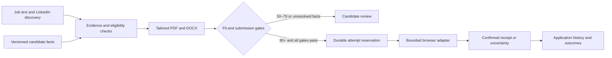

# Architecture

## Components

FastAPI serves a same-origin dashboard and a token-protected API. SQLite persists versioned profiles, jobs, applications, document manifests, provider attempts and an append-only event log. Documents and dedicated browser profiles live in the ignored data directory.

The deterministic policy engine owns score thresholds and submission gates. An optional OpenAI adviser selects evidence for a job. Model output never grants browser or submission permissions. Web pages and attached documents are untrusted content rather than executable instructions.

The renderer copies approved evidence into tailored PDF/DOCX documents. Questions are matched to explicit candidate-approved answer keys. The LinkedIn adapter uses a dedicated local browser session and the candidate's declared authorisation scope. It verifies job identity and description, bounds the number of steps, rejects unsupported fields and requires a visible confirmation. Its selectors are tested on intercepted fixtures and still require live account validation. No adapter modifies the public profile.

## Submission invariants

An immediate SQLite transaction reserves an attempt after checking automation, profile revision, documents, questions, fit, daily limit and provider capability. The attempt is committed before external activity. Success needs a provider receipt. A known pre-submission stop becomes review and records unknown question labels; failure after attempting the irreversible action becomes uncertain. A separate confirmed manual outcome can reconcile the attempt.

The worker checks the kill switch before each attempt. It cannot undo a submission already in flight. One application per canonical source identifier prevents duplicates. Editing evidence changes the revision and requires regenerating materials. Settings changes do not manufacture eligibility.

## Learning

Outcome feedback supports aggregate observations and candidate-reviewed suggestions. It does not self-train model weights, add skills, alter immigration facts, lower thresholds or fabricate experience. Small samples are reported as insufficient evidence, not causal proof.

## Official integration references

- [GPT-6.1 Sol](https://developers.openai.com/api/docs/models/gpt-6.1-sol)
- [Structured outputs](https://developers.openai.com/api/docs/guides/structured-outputs)
- [Greenhouse Job Board API](https://docs.greenhouse.io/job-board.html): public discovery is distinct from authenticated employer-owned application submission.
- [LinkedIn User Agreement](https://www.linkedin.com/legal/user-agreement)
