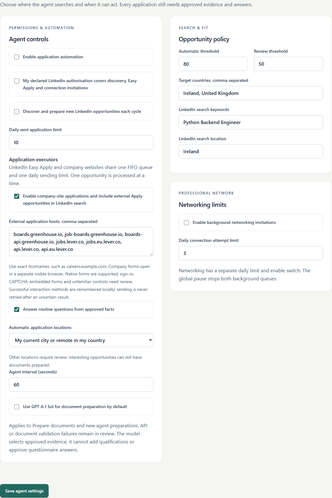

# Company-site applications

**Scout** now owns research and preparation; **Link** and **Bridge** are the two application executors. Both can diagnose recognised pre-send technical faults using GPT-6.1 Sol and reopen the same reviewed application twice within one held attempt. Bridge also receives primary external Apply destinations from Link. Live gates, archived documents and confirmed/uncertain outcomes remain shared. [Specialised agents](SPECIALISED_AGENTS.md) details routing, runtime budgets and learning.

Two specialised executors share the existing FIFO owner, approved candidate facts, vacancy-specific documents, review decisions, sending budget, history and global pause: LinkedIn Easy Apply and company websites. The second executor adds neither concurrent submissions nor another application quota.

## Setup and routing

Enable **Company-site applications** in Agent settings. Add exact HTTPS hostnames under **External application hosts** for other employers or portal endpoints. Defaults include public Greenhouse and Lever job-board/API hosts; enabling a hostname does not certify every layout on that platform.

When enabled, LinkedIn discovery omits its Easy Apply-only filter. It still reads and scores opportunities, preserves original URLs and excludes known/discarded vacancies. The LinkedIn executor rechecks the reviewed vacancy before choosing Easy Apply or handing an external Apply destination to the company executor. Apply buttons may open a tab or navigate the current tab. The company executor uses a separate visible, persistent Chromium profile at `data/browser/company-sites`.

**Add opportunity → Import from link** also accepts configured company URLs. Automatic extraction requires one complete JSON-LD `JobPosting`: title, hiring organisation, description and a single location. Missing or ambiguous metadata requires **Enter details manually**. Public Greenhouse board import remains available. No employer API key is requested: applicant-facing browser forms are used, rather than Greenhouse's authenticated application-submission endpoint.

## Supported form contract

- One visible native application form; the live title/company must match the reviewed opportunity.
- Recognised Apply actions, explicit reversible Next/Continue/Review buttons and a final Submit/Send application action. Implicit HTML submission semantics are never considered reversible Next actions.
- Native text, number, textarea, single-select, radio and checkbox controls, plus existing supported ARIA controls. Wrapped selects without IDs use unique reconstructed labels; ambiguous controls require review.
- Vacancy-specific CV and available cover-letter PDF uploads. Uploaded bytes must match archived hashes, including a recheck after model interpretation. Unknown required uploads and missing required cover letters require review.
- Up to ten form pages, retaining all reachable questions before stopping. Unknown required answers stay empty; prefills never count as approval. Questions behind provider validation cannot be collected safely until the missing answer is approved.
- Explicit post-click confirmation and a local screenshot/provider URL when capture succeeds. A final click without confirmation is **Uncertain**, retains its reservation and is never automatically repeated.

This version supports the native form contract, including Greenhouse/Lever-style forms. It does not certify every Greenhouse, Lever or Workday tenant. Sign-in, account creation, CAPTCHA, embedded/cross-origin forms, unfamiliar controls/actions and non-standard confirmation pages can require manual work.

## Interpretation and learning

GPT-6.1 Sol receives the value-free semantic layout and recognised action candidates. Structured output selects an observed identifier/type or requests review. It supplies no executable code, arbitrary selectors, destinations or candidate answers. Code rereads actions, approved fields and uploaded documents after model latency. Missing keys, a different model, API failure and invalid/changed plans stop before sending. Questionnaire answers continue through the existing approved-fact and owner-instruction interpreter.

Successful native form shapes are remembered locally by hostname and semantic layout. A later identical shape with one recognised action can reuse the verified method after rereading live controls. Checkbox/radio recovery also shares existing verified native/label/ARIA strategies. Memory contains methods and outcomes, never candidate answers or website instructions. Memory-write failure cannot downgrade a confirmed submission. Pre-send errors retain inert, value-free form HTML and the current stage in the activity log. Diagnostics support tested future repairs; the agent does not rewrite its code or train model weights autonomously.

## Sending boundaries

The atomic final gate also verifies current company-site enablement and destination hostname. Candidate/job revisions, document hashes, manual decisions, pause and quota checks remain mandatory. Portal destinations are claimed in that transaction to prevent duplicate sending through LinkedIn and direct imports. Released pre-send attempts may retry; confirmed/uncertain claims block duplicates. Normalisation preserves job identifiers and removes common tracking parameters; equivalent vacancies under different URLs cannot always be identified.

Request guards reject private DNS destinations, unsafe schemes/ports/credentials, unconfigured navigation/redirects and unconfigured mutating requests. Service workers are blocked in the company browser so they cannot bypass Playwright's request routes. Public HTTPS resources may load; additional submission/upload origins need hostname configuration. DNS validation is application-level protection, rather than OS network isolation or an IP-pinning guarantee. Original vacancy URLs and final screenshot/provider URLs remain in application history. Browser profiles, diagnostics, memory and screenshots stay private and untracked.

## Validation and references

Reproduce this screenshot after building with `uv run python scripts/capture_company_settings.py`. It uses a disposable fictional profile, blocks external requests and leaves automation disabled.

Intercepted Chromium journeys exercise real uploads/hashes, native fields, multipage forms, links, popup/same-tab buttons, approved answers, policy changes, duplicate destinations and uncertain confirmations. OpenAI responses are fictional: tests send no real applications or paid requests. See [testing](TESTING.md), [operations](OPERATIONS.md) and [security](SECURITY.md).

Primary references: [Greenhouse job-board authentication](https://docs.greenhouse.io/job-board.html), [Lever postings API](https://github.com/lever/postings-api), [OpenAI structured outputs](https://developers.openai.com/api/docs/guides/structured-outputs).
