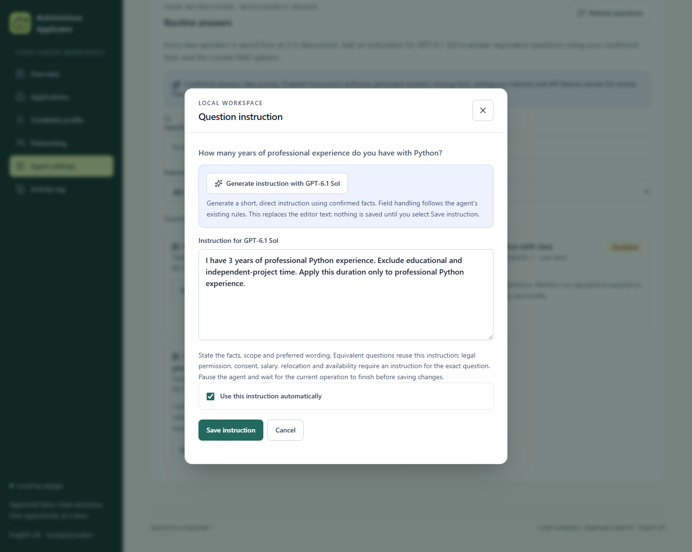

# Candidate-owned question instructions

The **Agent settings → Routine answers** tab is a private library of observed application questions and reusable instructions for **GPT-6.1 Sol**. The existing Questions tab still supports a separate AI draft and explicit application-specific approval.

## Configure an instruction

If a numerical experience question already has a legacy narrative in the profile, an exact enabled instruction can supply the explicitly confirmed duration. The generated answer retains its rule version through readiness checks and subsequent reuse; it does not overwrite the narrative or become an approval. A valid existing number, including one rejected by new field constraints, cannot be replaced through this exception. [Legacy duration handling](QUESTION_INTERPRETATION.md#legacy-duration-answers) records the precedence and failure boundaries. Restart a server that was started before the feature or correction was installed before expecting it to use these instructions.

1. Keep **Answer routine questions from approved facts** enabled in General settings.
2. Pause the agent and wait for the current application operation to finish.
3. Open Routine answers. Questions from existing records, imported opportunities and observed form pages appear automatically, including questions already answered. The open tab refreshes every 15 seconds and also has a refresh button, search and status filters.
4. Choose **Add instruction** or **Edit instruction**. Write the facts, scope and preferred wording, or select **Generate instruction with GPT-6.1 Sol** to fill the editor with a short, direct draft. Review and edit the result. Manual instructions retain the 4,000-character editor limit; generated drafts also have a 120-word limit.
5. Enable **Use this instruction automatically** and save. Enabling authorises the agent to generate an answer from that instruction when a compatible question appears. A blank or disabled instruction leaves the existing answer policy in place. Sensitive questions remain manual.

For example:

> I have 3 years of professional Python experience. Exclude educational and independent-project time. Apply this duration only to professional Python experience.

The prompt is an explicit instruction from the candidate, rather than text extracted from the provider. Facts or decisions stated there must be accurate. An instruction such as “make me sound experienced” supplies no missing factual evidence.

Saving does not start the agent. Pending applications which have encountered the question or used the previous instruction are queued for re-preparation. Their existing document files and manifests remain available until preparation replaces them. Use **Prepare documents** for an individual application, or start the agent when ready to process the queue. Submitted and uncertain records, confirmed answers, candidate revision and sending history remain unchanged.

## Generate an instruction draft

The modal's generation button creates a reusable instruction, rather than an application answer. It uses confirmed global candidate facts, verified evidence and distinct available field variants for the same normalised question. The catalogue, linked opportunity questions and cached observations contribute current type, exact choices, required status and constraints. Raw form HTML, prefilled values, direct contact facts and catalogued sensitive answers are not sent. Application-specific approvals are not promoted into global instructions.

The generator now requests **2–4 short imperative sentences**, aiming for **40–80 words**, with a hard maximum of **120 words**. The draft identifies the question-specific subject/scope, current approved fact or verified evidence, the decision or preferred wording, and any material exception. It uses direct wording when the facts settle a decision. Missing or conflicting facts still produce a specific confirmation request, rather than an invented answer. Material part-time/full-time, professional/educational and jurisdiction conditions remain essential.

General field handling belongs to the answering agent and browser: digits and requested units, short text, exact enabled choices, supported checkbox decisions, native constraints and review gates. Generated instructions do not repeat these rules or paragraphs about security, saving, enabling or submission. Observed field variants remain part of the generation context so an unusual question-specific distinction is retained. An incompatible Yes/No control cannot express years merely because a duration is approved. No draft adds support for an unfamiliar widget.

An oversized generated instruction is rejected without truncation, saving or a silent fallback. The editor retains its previous text and shows the existing retryable generation error. The 120-word limit applies only to new generated drafts; manually written prompts and existing saved instructions retain their current limits and contents. To replace an older verbose instruction, generate a fresh draft, review it and select **Save instruction** explicitly.

Prefer references to current approved facts rather than copying fixed durations into a reusable prompt. Missing facts or exceptional decisions produce a clarification note. The result cites supplied evidence/fact identifiers, which are validated locally; schema conformance and valid references do not prove every sentence correct. The candidate still reviews the complete prompt before saving. Sensitive questions remain manual, and unconfirmed candidate profiles cannot request generation.

The button shows **Generating instruction…**, disables duplicate requests and temporarily prevents edits/saves. A successful draft replaces only the editor text; it does not save, enable, approve, reprepare or resume anything. Closing the modal or locking the session discards a late result. API failure preserves the editor's existing text and displays a retryable error. Saving uses the existing versioned instruction endpoint and change-control rules.

`POST /api/question-instructions/{rule_id}/draft` requires local authentication, the instruction's expected version and the candidate revision in `If-Match`. The request uses `gpt-6.1-sol`, high reasoning, structured parsing, `store=False`, a 180-second timeout and no provider retries. A model mismatch, unusable output or unapproved source reference fails without a saved change. Candidate, instruction or available field-context changes during generation require a fresh draft. The [official model reference](https://developers.openai.com/api/docs/models/gpt-6.1-sol) and [structured outputs guide](https://developers.openai.com/api/docs/guides/structured-outputs?api-mode=responses) document the API capabilities; application validation and explicit saving remain separate gates.

The updated 6 October 2026 screenshot uses fictional local records and made no model or provider request. [Concise draft validation](TESTING.md#concise-question-instruction-drafts-6-october-2026) records the current focused acceptance and real-model checks. [Earlier draft validation](TESTING.md#field-aware-instruction-drafts-6-october-2026) remains a separate historical measurement.

## Matching and answer generation

An exact compatible candidate or application-specific approval takes priority. Existing deterministic contact and sponsorship mappings remain supported when an explanatory legacy approval does not fit the offered options. Generated answers never become global candidate facts.

The resolver prefers an enabled instruction for the same normalised question label. Otherwise GPT receives the enabled library and decides whether a question has the same meaning, subject and scope. It must distinguish technologies, compound requirements, professional and educational experience, units and countries. Recognised different experience subjects are also rejected locally. Legal permission, consent, salary, relocation and availability require an instruction for the **exact question**; a neighbouring question cannot supply those decisions.

The Responses API request uses `gpt-6.1-sol`, high reasoning effort, Pydantic structured parsing, `store=False`, a 180-second timeout and no automatic provider retry. Owner instructions are placed in the instruction layer. The actual question, value-free semantic HTML, enabled choices, native constraints, job description, verified evidence and approved fact values are treated as untrusted data. Direct contact fields, sensitive questionnaire answers and internal location approvals are omitted from the fact payload. Owner prompts themselves are deliberately sent to the model.

The structured result identifies the selected instruction, its supporting verbatim quote when it supplies a fact or decision, verified evidence/fact references, the answer and whether review is needed. The resolver checks actual model identity, instruction membership, supporting quotes, known subject boundaries and referenced facts before accepting an answer.

| Current control | Required output |
| --- | --- |
| Number or recognised numeric input | Digits, with the actual minimum, maximum and step respected |
| Free text | A concise, polite British English sentence, respecting observed length limits |
| Select, combobox or radio group | The exact enabled option label |
| Checkbox | An exact supported Yes/No decision; no inferred consent |
| Incompatible options, missing facts, ambiguous match or API failure | Review; no generated replacement or silent fallback for an applicable instruction |

The browser still checks the real control's native validity and verifies the resulting selection before advancing. Schema conformance is not proof of factual correctness or semantic equivalence. The [official structured outputs guide](https://developers.openai.com/api/docs/guides/structured-outputs) describes schema handling; the application's grounding, field and submission gates provide additional checks.

## Persistence and change control

Questions, observed control metadata, distinct application observations and instruction versions live only in the ignored local SQLite database. The catalogue does not persist raw semantic HTML or filled field values. Existing private error diagnostics retain their separate storage and access controls.

Answers are cached per application, candidate revision, job fingerprint, instruction version and current question/control signature. A change to type, choices, constraints or value-free semantic HTML requires a fresh interpretation. The cache signature includes a hash of that HTML, without storing its raw content in the catalogue. The provenance source is `question_instruction:<id>:<version>:<context-hash>`; previous prompts remain in a private version journal.

Edits use an expected version and reject stale drafts. The database rejects changes while an application operation or submission is active, and rejects an answer produced by an obsolete instruction. Changing or disabling a rule invalidates affected pending generated answers and queues readiness/preparation again. It never deletes explicit approvals, mutates an archived submission or promotes one application's approval to a different vacancy.

## Validation

The [complete-system acceptance](TESTING.md#full-system-validation-6-october-2026) includes all library regressions within the 1,436-case Python inventory. All 21 runtime modules reached 100% statements and branch outcomes. The complete React suite passed 181 cases with per-file 100% coverage in all 11 modules; the regenerated packaged-browser report has its separate measured scope and gates.

Focused tests cover library capture, existing-record backfill, 249-choice records, deduplication, authenticated endpoints, stale edits, version history, change invalidation, queue re-preparation, exact approval precedence, model/source failures, prompt trust boundaries and native constraints. Real Chromium tests complete and hold intercepted provider forms, verify observer restoration and exercise the packaged Settings tabs/modal on desktop and mobile.

A separate six-case test used the real GPT-6.1 Sol API with fictional facts. All six produced the expected outcome: exact and paraphrased numeric answers, a concise text answer, no cross-technology match, no unsupported salary answer, and review of conditional work permission. Observed calls took 3.72–8.03 seconds. This is a small regression sample, not a general accuracy or latency guarantee. No real application or invitation was sent. See [Testing](TESTING.md#question-instruction-library-6-october-2026) for the measured scope.
