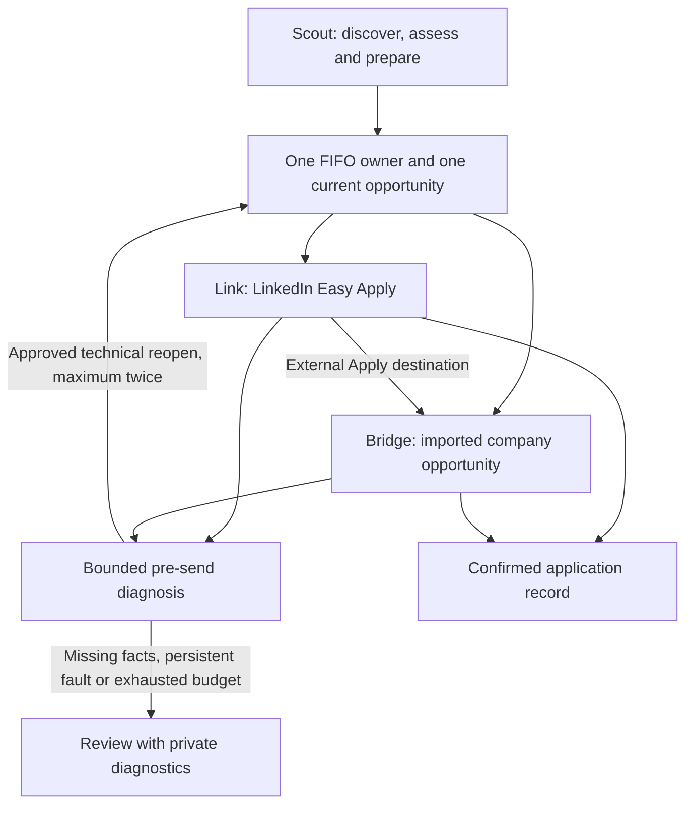
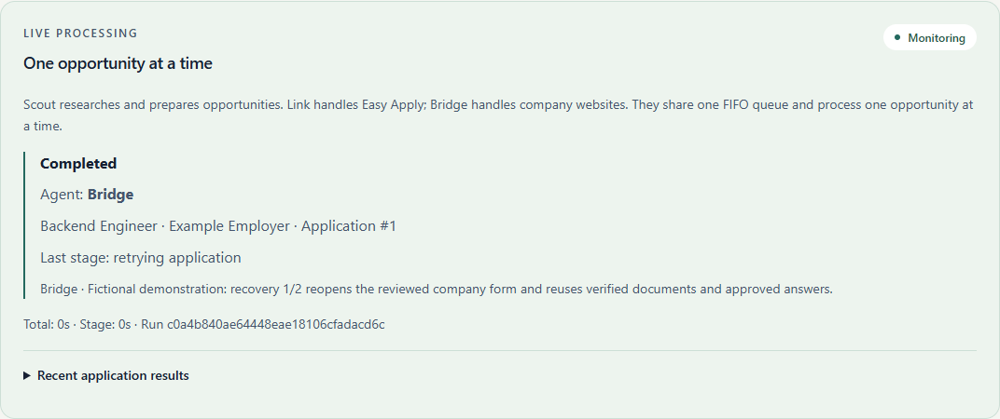

# Scout, Link and Bridge

Three specialised roles share the existing sequential worker. They do not run independent queues or send applications concurrently.

| Agent | Responsibility | Handoff |
| --- | --- | --- |
| **Scout** | Search LinkedIn, retain opportunity URLs, assess approved evidence, discard scores below the configured threshold, and prepare vacancy-specific documents. | The next eligible FIFO record goes to Link or Bridge after current readiness checks. |
| **Link** | Verify the LinkedIn vacancy and complete supported Easy Apply forms, including questions, document uploads and confirmation. | A primary Apply action leading to an approved company destination transfers execution to Bridge. |
| **Bridge** | Open the company application in its separate visible browser, interpret supported native forms and complete the same reviewed application. | A confirmed receipt completes the record; unsupported layouts or unresolved facts request review. |

The recovery arrow resumes the **current held attempt**, rather than selecting another record or adding another FIFO item. Scout owns research and preparation orchestration; the existing service and store remain the shared authorities for scoring, truthful answers, document integrity, ownership and sending policy. Link and Bridge specialise the audited browser adapters rather than duplicating their field handling.

## Runtime diagnosis and retries

Both application agents can diagnose a recognised technical failure and retry during the current execution. The controller first checks that Submit has not been attempted, no unanswered questions are pending, the stage permits recovery and the failure is technical. Eligible examples include a detached control, a loading timeout, an unchanged form step or an unconfirmed supported upload. Authentication, CAPTCHA, permission failures, changed vacancy identity, unsupported answers and validation errors are excluded.

GPT-6.1 Sol receives the agent, stage, exception class, step and bounded, inert, value-free diagnostic HTML when available. Its structured decision permits only **reopen** or **review**. It cannot supply executable code, selectors, answers, destinations or permission. A missing key, different model, invalid output or API error requests review without starting a retry.

Each held attempt permits at most **two runtime retries**. The count persists in private SQLite and survives controller recreation. Reopening validates the same reviewed opportunity again, rereads the live questions and uploads the same hash-verified archived CV and cover letter. It uses one attempt reservation and does not regenerate documents or add a confirmed send to the daily limit.

Before diagnosis and again after the model returns, the controller rechecks shutdown/pause, archived document integrity, current candidate and vacancy revisions, submission policy, held sending capacity and, for Bridge, external enablement and the approved destination. These checkpoints do not set a sending timestamp or claim a destination. The original atomic final sending gate still runs immediately before Submit.

A possible submission click always ends automatic recovery. Without a confirmed receipt, the attempt remains uncertain and requires reconciliation. A post-click review exception cannot release the sending reservation. Exhausted or rejected runtime recovery becomes a specific review hold and does not trigger the older cross-cycle technical-resumption rule.

## Learning and diagnostics

Confirmed runtime recoveries store a local method hint indexed by agent, actual destination hostname, stage, exception class and diagnostic shape. A matching previously successful method can avoid another diagnosis call, but still repeats all live checks. Any failed reuse disables that shortcut. This memory complements existing verified control, navigation, upload and company-form strategies; it neither trains model weights nor writes application code.

Failed-form HTML is retained even when a later retry succeeds. Private `runtime_recovery_attempt` events record the agent, failed stage, retry count, method source and diagnostic hash; `runtime_recovery_outcome` records confirmation or stopping. Raw HTML, provider exceptions and model reasoning are not copied into these events. Diagnostic HTML remains in the ignored private directory.

The dashboard monitor displays **Agent**, the current opportunity, current stage and elapsed time. `diagnosing_runtime_error` and `retrying_application` expose recovery progress. Existing historical runs without a role prefix remain readable.

*Captured on 8 October 2026 from a disposable fictional workspace. The labelled journal demonstrates presentation only; no provider, submission or model request was made. Reproduce with `uv run python scripts/capture_agent_roles.py` after building the UI.*

## Configuration and scope

There is one Start/Pause control, one operation lease and one sending limit. Existing scoring, review decisions, approved facts, networking preferences and archives retain their meaning. Company execution remains opt-in under Agent settings and uses configured public HTTPS hostnames. Enabling it also permits LinkedIn discovery of external Apply opportunities; disabling it retains Easy Apply-only discovery. [Company-site applications](COMPANY_APPLICATIONS.md) describes supported forms and browser boundaries.

Real websites can introduce new layouts, account verification or unreachable conditional questions. The bounded recovery is intended for supported transient faults; it does not claim universal ATS support or endlessly retry an unknown form. [Testing](TESTING.md) records intercepted browser journeys and the full regression results.
